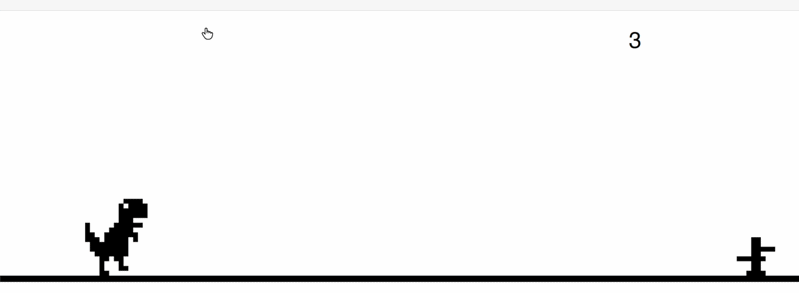
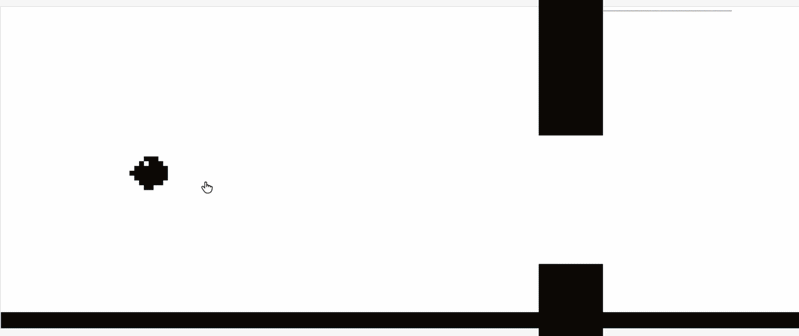
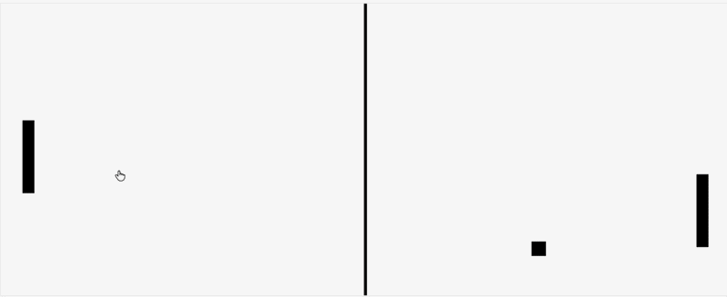
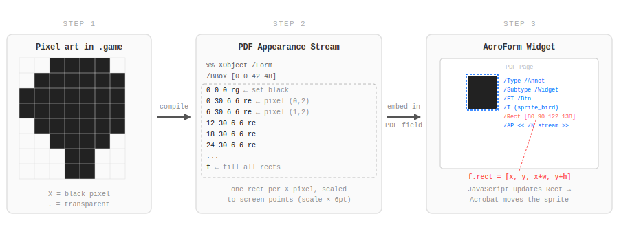
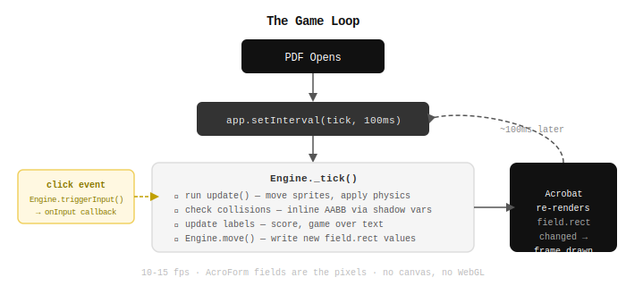
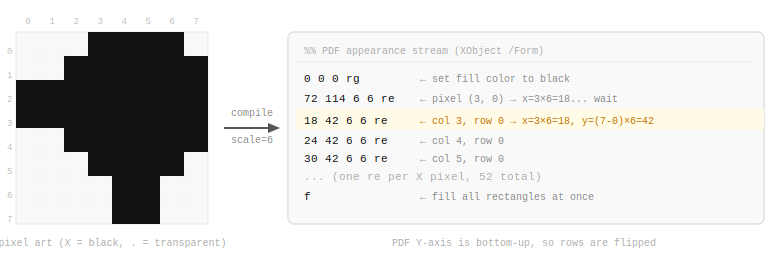
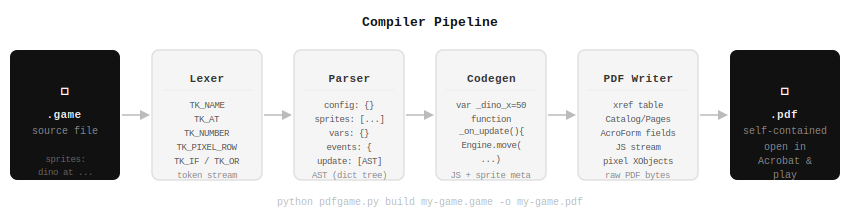

# Gaming in PDF? Why not.

> Yes. These are real PDFs. No tricks. Well — technically several tricks. OK fine, it's tricks all the way down. But it *works*.

<table>
  <tr>
    <td align="center"><b>Dino</b></td>
    <td align="center"><b>Flappy</b></td>
    <td align="center"><b>Pong</b></td>
  </tr>
  <tr>
    <td></td>
    <td></td>
    <td></td>
  </tr>
    <tr>
    <td><a href="https://github.com/joelibaceta/pdf-games/raw/main/games/dino/dino.pdf">Dino.pdf</a></td>
    <td><a href="https://github.com/joelibaceta/pdf-games/raw/main/games/flappy/flappy.pdf">Flappy.pdf</a></td>
    <td><a href="https://github.com/joelibaceta/pdf-games/raw/main/games/pong/pong.pdf">Pong.pdf</a></td>
  </tr>
</table>

> **Best experience: Adobe Acrobat Reader** (desktop) — enable JavaScript when prompted.  
> Chrome's built-in viewer works too, but with degraded rendering. macOS Preview and Firefox don't support PDF JavaScript — they never wanted to be fun.

---

## How does it even work?

Here's the part where I explain myself.

PDFs support JavaScript. Not "kind of" — full ES3, timers, DOM-adjacent APIs, the works. Adobe shipped this in 2003 and almost nobody talks about it, probably because the intended use case was "auto-calculate tax form totals." We had other plans.

PDFs also support **AcroForms** — interactive widget fields originally designed so you could type your name on a government document without printing it. There's a whole spec. It's very thorough. It was absolutely not designed for games.

We used it for games anyway.

### The trick: form fields as sprites

Every sprite you see is a `pushbutton` AcroForm widget field. Not an image. Not a canvas element. A *form field* — the same primitive used by your bank's PDF statements.

Each field has an **appearance stream**: a tiny PDF graphics program that describes what it looks like. We compile pixel art into that program — one rectangle-drawing command per black pixel. Then we slam the whole thing into a form field and call it a sprite.

<p align="center">
  
</p>

Moving a sprite? We just update the field's `rect` property. Acrobat re-renders immediately. That's it. That's the whole trick.

```javascript
// This is the entire rendering pipeline
f.rect = [newX, pageH - newY - h, newX + w, pageH - newY];
```

No canvas. No WebGL. No `requestAnimationFrame`. A PDF form field sliding around the page at 10fps.

### The game loop nobody asked for

Acrobat has a timer. *It has a timer.* `app.setInterval`. Sitting right there in the spec, unbothered, waiting to be abused.

<p align="center">
  
</p>

```javascript
app.setInterval("Engine._tick()", 100); // 10fps and we are proud of it
```

Every tick: move sprites, check collisions, update scores. Acrobat re-renders the fields. The player sees a game. Nobody needs to know.

### Pixel art → PDF drawing commands

Sprites are written as `X`/`.` grids. The compiler turns each `X` into a rectangle command in the PDF appearance stream:

<p align="center">
  
</p>

One XObject per sprite. Zero images. Zero external files. The entire game — sprites, physics engine, game logic — ships as a single self-contained `.pdf`. You can email it. You can attach it to a Jira ticket. You can print it (please don't).

---

## It's not just three games — it's an engine

The real thing here is **`pdfgame`**: a compiler that turns `.game` source files into playable PDFs. Write the game logic in a simple DSL, run one command, open the PDF.

```
game:
    title = "My PDF Game"
    width = 500
    height = 200
    fps   = 10

sprites:
    player at (50, 100) scale 3:
        .XXX.
        XXXXX
        .XXX.
        ..X..
        .X.X.

vars:
    speed = 5

on click:
    player.x = player.x + speed

on update:
    if player.x > 480:
        player.x = 10
```

```bash
python pdfgame.py build my-game.game -o my-game.pdf
# open my-game.pdf in Acrobat
# it works
# tell no one how
```

<p align="center">
  
</p>

→ **[Language reference, tutorial, and all the implementation details you didn't ask for](docs/how-it-works.md)**

---

## The games

| Game | Controls | What's happening |
|------|----------|-----------------|
| **Dino** | Click to jump | Endless runner. Two cacti with independent random spawn timing. Difficulty scales every 20 ticks until you lose. |
| **Flappy** | Click to flap | Two pipe pairs. Gap height, gap width, and inter-pipe distance are all randomized on each spawn. |
| **Pong** | Click to reverse paddle | Your paddle oscillates on its own — you just control the direction. The CPU cheats a little. First to 5. |

---

## Try it

Download any PDF from the `games/` folder. Open it in Adobe Acrobat Reader. Enable JavaScript when prompted. That's the entire setup.

No install. No runtime. No `npm install`. Just a PDF.

→ **[Build your own game](docs/how-it-works.md)**

---

## Why

The PDF spec is 1,000+ pages long. Somewhere in there is a JavaScript engine, a timer API, and an interactive form widget system powerful enough to run Pong.

Someone had to find out.
